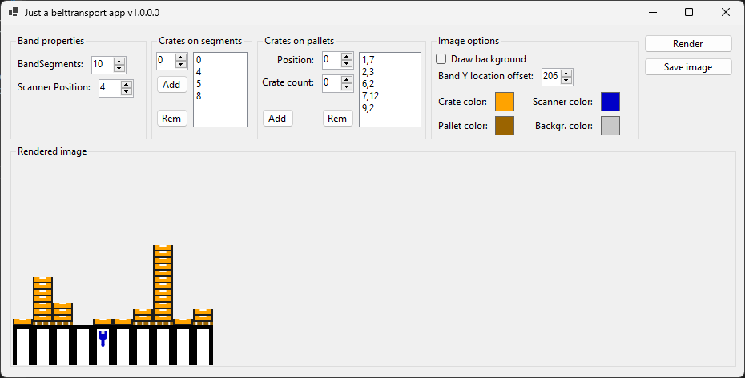
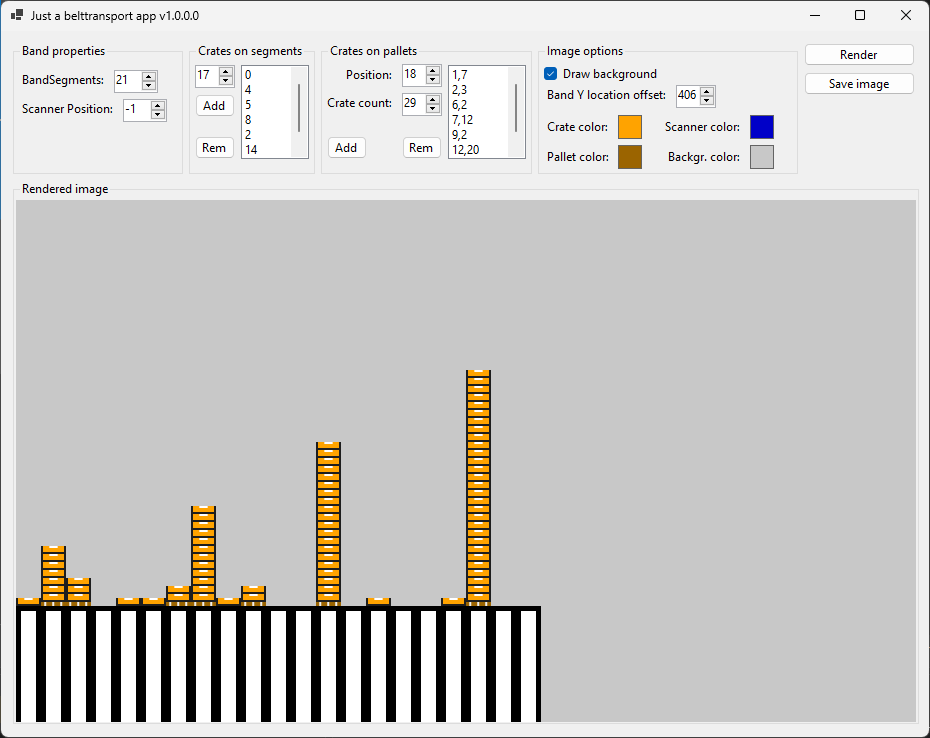
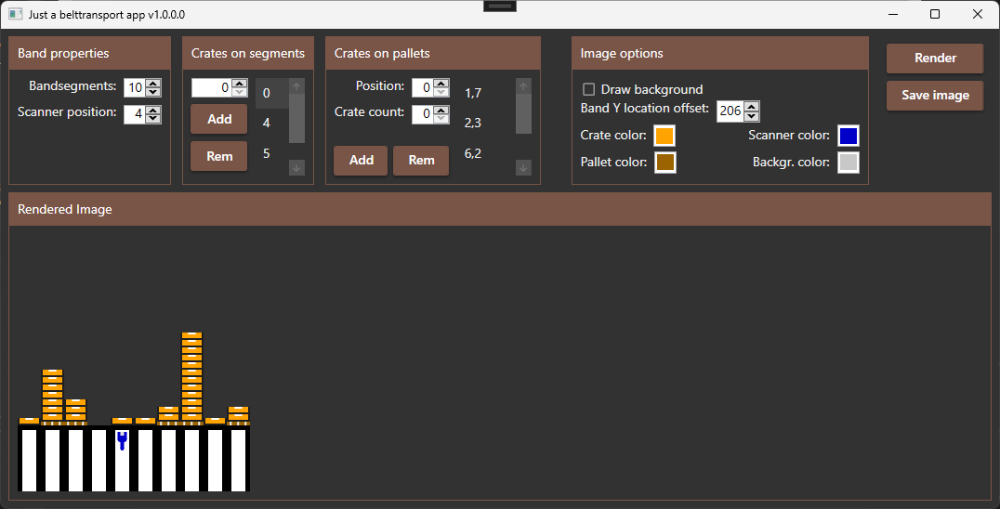
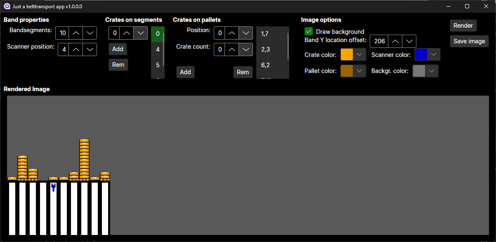

# TransportBelt Visualizer
---

This application is primarily used to render and visualize images representing transport belts in a highly interactive and user-friendly interface.
TransportBelt Visualizer is a library that can be used to generate visual representations of transport belts in various contexts, such as manufacturing, logistics, and warehousing.

This project includes samples for the following GUI frameworks:

- WinForms (Windows)
- WPF (Windows)
- Avalonia (cross-platform)

The application's main feature is its ability to generate a visual representation of transport belts.
These visualizations can be used to understand the layout and operation of transport belts in various contexts, such as manufacturing, logistics, and warehousing.

### Screenshots:

---

#### WinForms

---

#### WPF

---

#### Avalonia

---

### Enjoying this?
Just star the repo or make a donation.

Your help is valuable since this is a hobby project for all of us: we do development during out-of-office hours.

### Contribution
Pull requests are very welcome.

### Copyrights
FeetFinder was initially written by **Markus Karl Wackermann**.